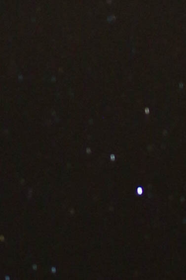

# DSLR Automation

To automate DSLRs, I use [gPhoto](https://github.com/gphoto) as a library and as a CLI (simple as, `apt-get install gphoto`).

## Focusing on the Stars

Getting crisp focus on stars with a DSLR is a pain in the neck! We need autofocus for long exposures. I don't care if it takes 20 min, as long as I can be kissing [Tracey](https://twitter.com/traceyann1972) under the stars while the machines autonomously take care of the tedious setup.

### Why not Infinity?

Just like in robotics, the [math never matches reality "Infinity" ≠ ∞](http://leyetscapes.com/edu/infinity-focus.html). Heat/cold causes things to change. Cameras are made to go "to infinity, and beyond!" so that autofocus PID controller can overshoot, etc. It changes by a couple microsteps throughout the night even. Even once automated, it's not perfectly repeatable because of backlash in the motor - have to approach from same direction and completely reset if it overshoots. All the same stuff as in robotics.

### Manual Solutions

Some manual suggestions include autofocusing on a distant street lamp or the moon if it's out, or to manually focus on a distant mountain during the day and then don't touch it until nighttime. Otherwise, you get is as close as possible by eye and then take *many* test shots.

### Automated Solution

I'm looking into algorithms to determine focus quality, but at the very least for now we can use [this bash script](focus.sh) to take test shots from which to choose the best setting. Then, use [this script](experiment.sh) to experiment with ISO, aperture, shutter speed, ... Finally, capturing the sky with [this one](capture.sh).

#### Example

Notice that ∞ is indeed blurry and it's not until about ∞-14 that it becomes clear. These are in microsteps ("Near1", smallest allow by Canon):

* ∞ 
* ∞-1 
* ∞-2 
* ∞-3 
* ∞-4 
* ∞-5 
* ∞-6 
* ∞-7 
* ∞-8 
* ∞-9 
* ∞-10 
* ∞-11 
* ∞-12 
* ∞-13 
* ∞-14 
* ∞-15 
* ∞-16 
* ∞-17 
* ∞-18 
* ∞-19 
* ∞-20 

